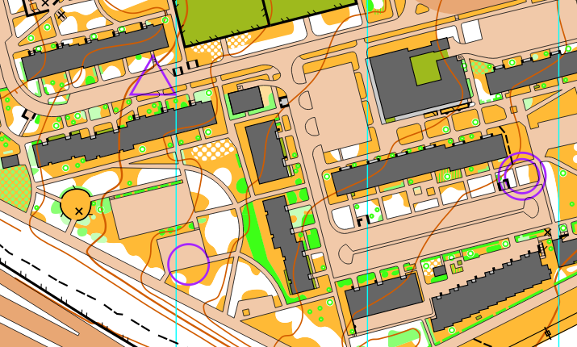
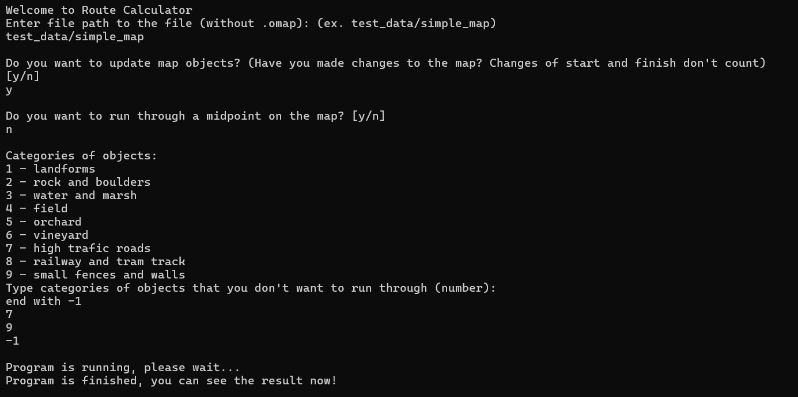
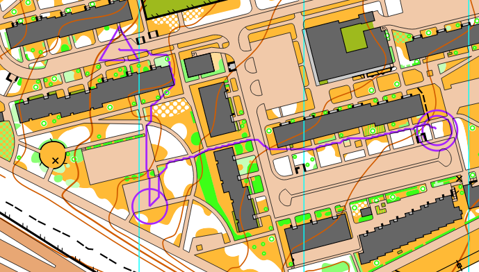

# Route Calculator
Route Calculator is a program finding the fastest route between start and finish in a sprint orienteering map (.omap). 

## Table of contents of this readme
- [Contains](#contains)
- [Documentation](#documentation)
- [Installation](#installation)
- [Usage](#usage)
- [Závěr](#závěr)
- [License](#license)
- [Information](Information)
- [Sources](Sources)

## Contains
Projekt obsahuje následující složky:
- Route_calculator - složka se samostatným programem, solution z Visual Studia
    - Route_calculator - složka se zdrojovým kódem a testovacími daty
        - test_data - two map files for testing
        - main.cpp - main file
        - tinyxml2.cpp - addon library
        - tinyxml2.h - addon library
    - x64/Debug/Route_calculator.exe - option for running the code
    - Route_calculator.sln - visual studio solution for more options
- docs
    - images
    - technical_docs
- README.md

## Documentation
The whole documentation can be found under /docs.

## Installation
Follow the next steps to install the program.
1. Clone repository from gitlab:

Clone with SSH:
git@gitlab.mff.cuni.cz:teaching/nmin201/2023/zapoctak-simsamar.git

Clone with HTTPS:
https://gitlab.mff.cuni.cz/teaching/nmin201/2023/zapoctak-simsamar.git

2. Install dependencies:

a) Install Boost Libraries: 
https://www.boost.org/users/download/

b) Install Open Orienteering Mapper to view map files:
https://www.openorienteering.org/mapper-manual/pages/installation.html

3. Link dependencies:
 - Go to Visual Studio, right click on the project in solution explorer
 - select Properties
 - choose C/C++ from the left list
 - In Additional Include Directories 
    - include the path to the folder Route_calculator/Route_calculator, where the tinyxml2.h file is stored (as it is in the repository)
    - include the path to the Boost libraries to the directory containing folder "boost".

## Usage

### Prerequisites
1. In your .omap file, add precisely one start triangle (code 701) and one finish double circle (706). If desired, add at most one midpoint circle (703). It should look like the picture below: [1]

### Steps of running the program
For visual documentation look at the picture below:
1. Open solution in Visual Studio (Route_calculator/Route_calculator.sln), run Route_calculator/Route_calculator/main.cpp file or run Route_calculator/x64/Debug/Route_calculator.exe.
2. Terminal pops up, here you need to specify how to use the program.
3. Write the path to your .omap file.
4. Specify, if you want to update the map after last usage. Use when you change objects in the map. Doesn't apply to changes in start and finish.(Information about objects in the map is processed and saved in another file. This processing takes a lot of time.)
5. Specify, if you want to calculate route to finish through a checkpoint on the map.
6. Select categories of objects that you want the route to avoid.
7. Wait for the program to finish.
8. You can now see the route in a .omap file in the same folder as your map file, with _route.omap ending. You can see an example of the result lower.

## Závěr
Při vypracování práce jsem se setkal s několika problémy. Nejprve jsem bojoval se správným napojování knihoven. Problém byl ve špatném zvolení adresářů při linkování header souborů. V samotném vypracování programu a algoritmu bylo velkou složkou zpracování xml (.omap) souboru. Po prozkoumání struktury souboru jsem přišel na to, jak se v souboru s mapou dostat ke všem jejím elementům - seznamu se symboly, objektům. Symboly v souboru byly číslované vlastním interním číslováním. To jsem musel propojit s externím číslováním z dokumentu ISSprOM. Vyřešil jsem to pomocí std::map mezi těmito číslováními. 

Přemýšlel jsem také, jak vyobrazit mapu pro využití pro A* algoritmus. Nakonec jsem zvolil čtvercovou síť bodů s takovým rozestupem, aby algoritmus nemohl přeskočit vyobrazené zdi na mapě. Narazil jsem ale na to, že vytvoření této sítě bodů je velmi časově náročné. V souboru s mapou totiž může být velmi mnoho objektů, které musím vepsat do této sítě. Zvolil jsem proto možnost, že tuto síť bodů budu ukládat do pomocného textového souboru. Tento soubor budu aktualizovat pouze při změnách v mapě. 

Časovou náročnost také zvyšovaly objekty s chodníky, které jsou na mapě ve městě nejčastějším objektem. Zároveň ale tyto chodníky neovlivňují rychlost běhu. Nastavil jsem proto základní cenu průběhu jednotlivými body v grafu na tuto cenu běhu po chodníku. Tyto objekty chodníků jsem pak přestal zpracovávat a čas programu se zrychlil.

Se samotným A* algoritmem takový problém nebyl. Nejvíc času zabrala samotná příprava mapy před spuštěním programu.

Prvotním záměrem programu byla možnost jeho využítí pro stavbu tratí v orientačním běhu. Zde nerozhoduje délka postupu, ale spíše rychlost probíhání jednotlivými místy, v lese, na louce atd. Cenu probíhání jednotlivými objekty jsem vypsal ručně. Porovnání rychlostí běhu v různých terénech by bylo tématem jiné práce. 

Celkově jsem s výsledkem poměrně spokojený. Program nachází trasu, která je na první pohled velice dobrá. Hlavním nedostatkem programu je pohyb doprava, doleva nebo po diagonálách. Pro úplně optimální trasu by bylo potřeba vytvořit hustší síť bodů. Časová a paměťová náročnost by ale vyskočila prudce nahoru.

## License
This program is open to free use for all parties. No citation needed and there are no copyrights. It uses tinyxml2 [2] and boost library [3]. Here are their licenses:

TinyXML-2 is released under the zlib license:

This software is provided 'as-is', without any express or implied warranty. In no event will the authors be held liable for any damages arising from the use of this software.

Permission is granted to anyone to use this software for any purpose, including commercial applications, and to alter it and redistribute it freely, subject to the following restrictions:

1. The origin of this software must not be misrepresented; you must not claim that you wrote the original software. If you use this software in a product, an acknowledgment in the product documentation would be appreciated but is not required.
2. Altered source versions must be plainly marked as such, and must not be misrepresented as being the original software.
3. This notice may not be removed or altered from any source distribution.

Boost Software License - Version 1.0 - August 17th, 2003

Permission is hereby granted, free of charge, to any person or organization
obtaining a copy of the software and accompanying documentation covered by
this license (the "Software") to use, reproduce, display, distribute,
execute, and transmit the Software, and to prepare derivative works of the
Software, and to permit third-parties to whom the Software is furnished to
do so, all subject to the following:

The copyright notices in the Software and this entire statement, including
the above license grant, this restriction and the following disclaimer,
must be included in all copies of the Software, in whole or in part, and
all derivative works of the Software, unless such copies or derivative
works are solely in the form of machine-executable object code generated by
a source language processor.

THE SOFTWARE IS PROVIDED "AS IS", WITHOUT WARRANTY OF ANY KIND, EXPRESS OR
IMPLIED, INCLUDING BUT NOT LIMITED TO THE WARRANTIES OF MERCHANTABILITY,
FITNESS FOR A PARTICULAR PURPOSE, TITLE AND NON-INFRINGEMENT. IN NO EVENT
SHALL THE COPYRIGHT HOLDERS OR ANYONE DISTRIBUTING THE SOFTWARE BE LIABLE
FOR ANY DAMAGES OR OTHER LIABILITY, WHETHER IN CONTRACT, TORT OR OTHERWISE,
ARISING FROM, OUT OF OR IN CONNECTION WITH THE SOFTWARE OR THE USE OR OTHER
DEALINGS IN THE SOFTWARE.

## Information
Martin Šimša, MFF CUNI, 2. roč., Matematika pro informační technologie (MITP)
ZS 2023/2024, Programování 3 - NMIN201
simsa.martin@email.cz
Supervisor: RNDr. Martin Pergel, Ph.D.

## Sources
[1] https://orienteering.sport/iof/mapping/
[2] https://github.com/leethomason/tinyxml2
[3] https://www.boost.org/